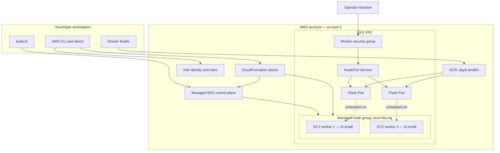

# Day 9 AWS Architecture

## The deployed system

The application was small, but the request crossed several independently managed layers.



The diagram shows logical relationships. Kubernetes may schedule both replicas on one worker unless topology rules or resource constraints require distribution.

## Responsibility by layer

| Layer | Resource | Responsibility in this session |
|---|---|---|
| Identity | IAM user and service roles | Authenticated the operator and allowed AWS services to act |
| Infrastructure orchestration | `eksctl` and CloudFormation | Translated cluster configuration into AWS resources and exposed failure events |
| Managed Kubernetes | EKS control plane | Hosted the Kubernetes API and coordinated cluster state |
| Compute | EC2 managed node group | Ran kubelet, networking components, and Flask Pods |
| Registry | ECR | Stored the AMD64 container image for worker-node pulls |
| Network boundary | VPC and security groups | Controlled which network traffic could reach the workers |
| Service discovery | Kubernetes Service | Selected Pods and provided stable routing to port 5000 |
| Workload | Deployment and Pods | Maintained two replicas of the Flask container |
| Configuration | ConfigMap and Secret | Supplied environment-specific and sensitive values |

## Provisioning flow

```text
eks/eks-cluster.yaml
        |
        v
      eksctl
        |
        +--> CloudFormation cluster stack --> EKS control plane + VPC resources
        |
        +--> CloudFormation node-group stack --> IAM role + Auto Scaling + EC2 nodes
                                                       |
                                                       v
                                             nodes join the cluster
```

This explains why CloudFormation was the right place to investigate the failed `t3.medium` attempt. `eksctl` was the entry point, but CloudFormation events recorded which underlying AWS resource failed and why.

## Application request path

```text
Browser
  -> http://<worker-public-ip>:<node-port>
  -> EC2 worker security group
  -> kube-proxy / NodePort rule
  -> arun-flask-service port 80
  -> selected Pod IP, targetPort 5000
  -> Flask process
```

Three port concepts were involved:

| Port | Meaning |
|---|---|
| `5000` | Port on which Flask listens inside the container |
| `80` | Stable Service port inside the Kubernetes service model |
| assigned NodePort | Port opened on the worker node for the lab's external entry point |

The NodePort was assigned dynamically because `nodePort` was not hard-coded in the Service manifest.

## Image delivery and architecture

```text
Apple Silicon Mac (ARM64)
        |
        | docker buildx --platform linux/amd64 --push
        v
ECR image tag: day9-amd64
        |
        | authenticated node image pull
        v
EKS EC2 workers (AMD64) -> container starts successfully
```

An image reference alone does not guarantee compatibility. Its operating system and CPU architecture must match a platform available on the destination node. Buildx provided an explicit target instead of relying on the workstation default.

For mature pipelines, a multi-architecture image can publish both `linux/amd64` and `linux/arm64` under one manifest list:

```bash
docker buildx build \
  --platform linux/amd64,linux/arm64 \
  -t <ECR_URI>:<IMMUTABLE_TAG> \
  --push .
```

## Kubernetes configuration boundary

The local Docker Desktop cluster and Amazon EKS are separate clusters with separate API databases. A namespace, ConfigMap, Secret, Deployment, or Service created locally does not exist in EKS until it is created there.

```text
Docker Desktop cluster state  -X->  Amazon EKS cluster state

Source manifests / secure configuration process
                    |
                    +--> apply to local cluster
                    +--> apply to EKS cluster
```

This is why the ConfigMap and Secret had to be recreated before the EKS Deployment could become Ready.

## Lab architecture versus production

| Day 9 lab | Production-oriented direction |
|---|---|
| Public worker nodes | Private worker subnets |
| Public Kubernetes endpoint | Restricted public CIDRs or private endpoint |
| Direct NodePort access | ALB/NLB through an ingress or `LoadBalancer` Service |
| One manually opened port | Load-balancer-to-node/pod security-group rules |
| Fixed two-node capacity | Cluster Autoscaler or Karpenter with suitable bounds |
| Mutable human-managed credentials | Federated, short-lived role sessions |
| Secret created from terminal input | External secret store and controlled rotation |
| Image tag used for deployment | Immutable tag plus digest pinning and provenance |
| Flask development server | Production WSGI server with probes and graceful shutdown |

