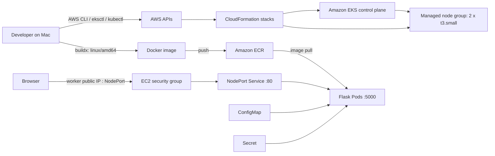

# Day 9 — Deploying the Flask Application to Amazon EKS

Day 9 moved the project from a local Docker Desktop Kubernetes cluster to a real Amazon EKS environment. The work covered more than a successful deployment: it included identity setup, infrastructure planning, failed cluster creation, instance-type correction, container architecture diagnosis, ECR publishing, application configuration, external access, verification, and cost-conscious cleanup.

This documentation records the actual path taken, including the decisions and failures that made the exercise useful.

## Environment and resources

| Item | Session value |
|---|---|
| AWS Region | `us-east-1` |
| EKS cluster | `arun-eks-cluster` |
| Managed node group | `arun-eks-ng` |
| Final worker type | `t3.small` |
| Desired workers | `2` |
| Kubernetes namespace | `arun-devops` |
| Deployment | `arun-flask-deployment` |
| Service | `arun-flask-service` (`NodePort`) |
| ConfigMap | `arun-flask-config` |
| Secret | `arun-flask-secret` |
| ECR repository | `arun-jenkins-flask-app` |
| ECR image tag | `day9-amd64` |
| Container port | `5000` |
| Service port | `80` |

The account ID appears in the repository's current image URI. Reusable commands in these guides calculate it dynamically or use `<AWS_ACCOUNT_ID>` so the documentation does not depend on one account.

## What was accomplished

- Stopped using the AWS root identity for day-to-day CLI work and configured an IAM user.
- Installed and verified AWS CLI, `kubectl`, Docker, and `eksctl` on macOS.
- Described the EKS cluster in an `eksctl` configuration file and inspected it with dry-run.
- Diagnosed a failed `t3.medium` node-group creation through CloudFormation events.
- Replaced `t3.medium` with `t3.small` and created a two-node managed node group.
- Identified that an image built on Apple Silicon was ARM64 while the EKS nodes expected AMD64.
- Used Docker Buildx to build and push `linux/amd64` image `day9-amd64` to ECR.
- Updated the Deployment to use the full ECR image URI.
- Recreated the namespace-scoped ConfigMap and Secret that had existed only in the local cluster.
- Applied the Deployment and NodePort Service and confirmed healthy Pods and endpoints.
- Opened a narrowly scoped worker-node security-group rule for the assigned NodePort.
- Reached the Flask application in a browser using a worker public IP and NodePort.
- Deleted the EKS cluster and verified that chargeable supporting resources were gone, while intentionally keeping ECR.

## End-to-end architecture

## Documentation map

1. [Practical Steps](01-Practical-Steps.md) — the complete implementation path and verification commands.
2. [AWS Architecture](02-AWS-Architecture.md) — how IAM, EKS, EC2, CloudFormation, ECR, networking, and Kubernetes fit together.
3. [Troubleshooting](03-Troubleshooting.md) — the real failures, symptoms, diagnosis, and fixes.
4. [Interview Questions](04-Interview-Questions.md) — concise questions and answers based on this deployment.
5. [Best Practices](05-Best-Practices.md) — production improvements and operational habits.
6. [Cost Optimization](06-Cost-Optimization.md) — cost drivers, cleanup, and verification.
7. [Day 9 Learning Notes](07-Day-09-Learning-Notes.md) — observations, lessons, commands, and a project summary.

## Important boundary

The NodePort plus public worker IP approach was appropriate for a short learning exercise. It is not the normal production exposure model. A production service should normally run worker nodes in private subnets, accept traffic through an AWS load balancer or ingress controller, use TLS, restrict sources, and manage DNS and certificates deliberately.

Similarly, Kubernetes Secrets are not automatically a complete secrets-management solution. The exercise recreated an Opaque Secret so the Deployment could start; a production system should use encryption at rest, tightly scoped RBAC, and preferably AWS Secrets Manager or Systems Manager Parameter Store through an approved integration.

